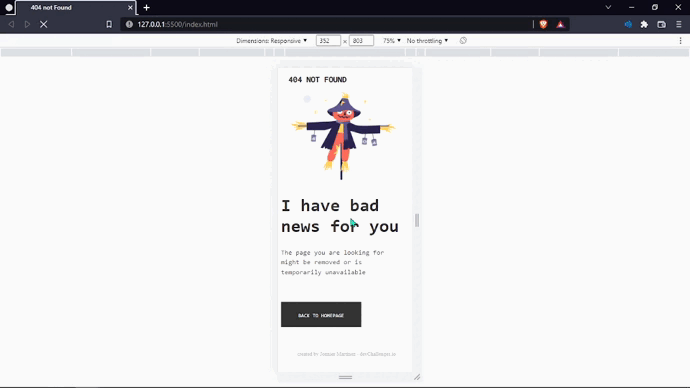

<!-- Please update value in the {}  -->

<h1 align="center">404-not-found-master</h1>

   Solution for a challenge from  <a href="http://devchallenges.io" target="_blank">Devchallenges.io</a>.

  <h3>
    <a href="https://github.com/jonniermartinez/404-Not-Found">
      Solution
    </a>
     | 
    <a href="https://jonniermartinez.github.io/404-Not-Found/">
      Demo
    </a>
     | 
    <a href="https://devchallenges.io/challenges/wBunSb7FPrIepJZAg0sY">
      Challenge
    </a>
  </h3>

<!-- TABLE OF CONTENTS -->

## Table of Contents

- [Overview](#overview)
  - [Built With](#built-with)
- [Features](#features)
- [Contact](#contact)
- [Acknowledgements](#acknowledgements)

<!-- OVERVIEW -->

## Overview

**404 not found**

- **Where can I see your demo?**

[Here](https://github.com/jonniermartinez/404-Not-Found)

- **What was your experience?**

I was having some difficulties with the footer but finally, I solve the problem

- **What have you learned/improved?**

I learned how to start with mobile firts and put the footer in the botton of the page

### Built With

<!-- This section should list any major frameworks that you built your project using. Here are a few examples.-->

- Html5
- CSS3

## Features

<!-- List the features of your application or follow the template. Don't share the figma file here :) -->

This application/site was created as a submission to a [DevChallenges](https://devchallenges.io/challenges) challenge. The [challenge](https://devchallenges.io/challenges/wBunSb7FPrIepJZAg0sY) Was to build an application to represent a 404 error and the users don't leave the page.

## Contact

- linkeding [linkedin.com/jonnier-alejandro-martinez-sanchez](https://co.linkedin.com/in/jonnier-alejandro-martinez-sanchez)
- GitHub [@jonniermartinez](https://github.com/jonniermartinez)
- Twitter [@JonnierMartinez](https:/twitter.com/jonniermartinez)
